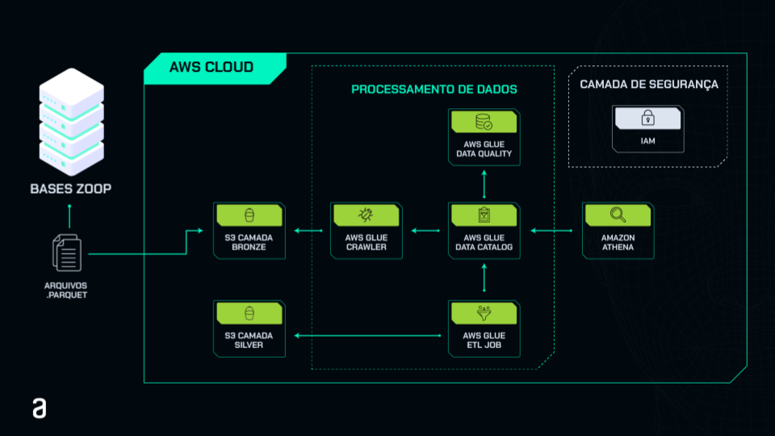

# Engenharia de Analytics: Implementando um pipeline ETL com AWS Glue

## Storytelling 

Este repositório faz parte de um treinamento para o cargo de Engenheiro(a) de Analytics Júnior na Zoop. Durante o treinamento, o Head de Dados disponibilizou três bases de dados, e você deve usar serviços da AWS para analisá-los, gerando relatórios e dashboards.

O foco principal do curso está na ingestão de dados e no processo de ETL (Extração, Transformação e Carga), criando as camadas bronze e silver do projeto:
- **Camada Bronze:** Armazena os dados brutos, como foram recebidos.
- **Camada Silver:** Contém os dados tratados conforme as requisições passadas pelo Head de Dados.

Para completar essas tarefas, você terá permissão de acesso a alguns dos serviços AWS por meio de um usuário IAM, criado a partir de orientações passadas pelo Head para fins de treinamento.

### Base de Dados:
- **Zoop**:
  - `vendas_zoop_bronze.parquet`
  - `estoques_zoop_bronze.parquet`
  - `redes_sociais_zoop_bronze.parquet`

## Objetivo 

Este curso visa a criação de um pipeline de ETL com o AWS Glue, partindo da ingestão de dados via um bucket S3 até a transformação desses dados em tabelas organizadas para consultas no AWS Athena e geração de relatórios no AWS QuickSight. O pipeline envolverá:

- Upload de dados em buckets S3
- Criação das camadas bronze (dados brutos) e silver (dados transformados)
- Configuração de banco de dados e tabelas no AWS Glue Data Catalog
- Construção de pipelines de ETL com AWS Glue Studio
- Realização de consultas ad-hoc com AWS Athena

### Tech Stack:
- **Amazon S3**
- **AWS Glue Crawler**
- **AWS Glue Data Catalog**
- **AWS Glue ETL Job (Studio)**
- **AWS Glue Data Quality**
- **Python**
- **Apache Spark**
- **Athena**
- **SQL**

&nbsp;

Embora o curso não cubra a criação de data lakes ou a análise avançada dos dados, ele fornecerá a base para essas tarefas futuras.

## Público Alvo 

Este curso é voltado para:
- Pessoas interessadas em implementar pipelines de ETL com AWS para transformar dados brutos em dados prontos para análise.
- Profissionais buscando seguir uma carreira em Engenharia de Analytics, com foco em processos essenciais de coleta e tratamento de dados.

## Pré-requisitos

É necessário ter conhecimentos básicos de Python, especialmente na biblioteca **PySpark** para processar grandes volumes de dados de forma distribuída e eficiente, utilizando DataFrames e comandos SQL.

---

Este curso oferece uma experiência prática em Engenharia de Analytics, utilizando serviços da AWS para criar um pipeline de ETL, que será fundamental para realizar análises e gerar insights a partir de grandes volumes de dados. 

### Alerta Importante:
Dado o uso de serviços pagos na AWS, é fundamental monitorar e otimizar os custos, seguindo práticas de **FinOps** para balancear eficiência e controle financeiro durante o desenvolvimento do projeto.